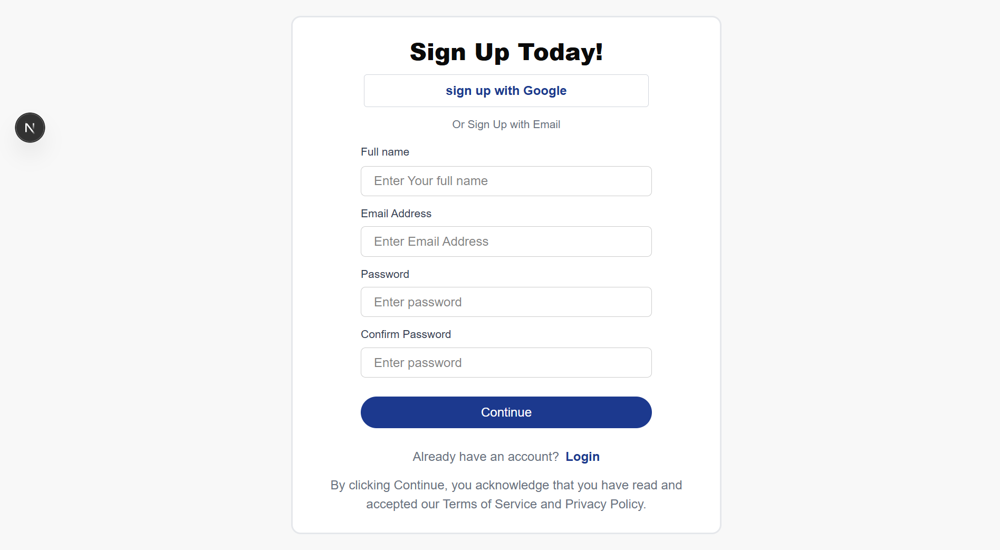
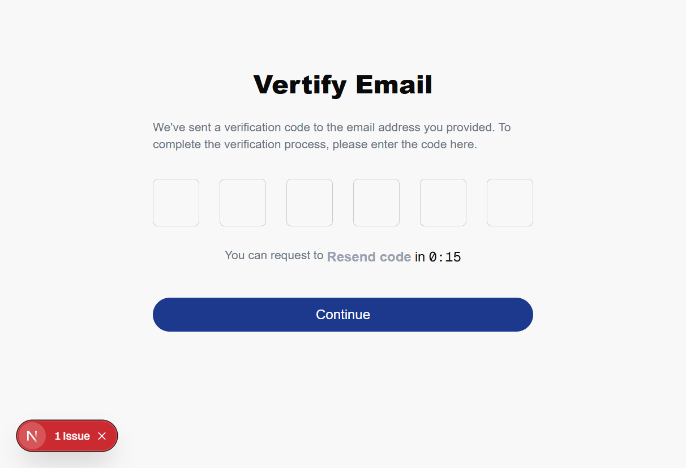
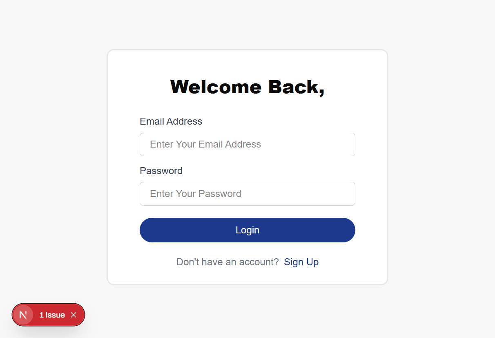

#  Auth App with NextAuth

This is a full-featured authentication app built with **Next.js**, **TypeScript**, **React Hook Form**, and **NextAuth.js** that supports:

- Google OAuth
- Email/password signup and login
- Email verification via OTP
- Secure session management

---

## 📌 Features

- User Signup with Full Name, Email, and Password
- Validation using React Hook Form
- Email Verification with OTP
- Login using Credentials or Google OAuth
- Protected Routes
- Session-based Authentication via `next-auth`

---

## Screenshots

### Sign Up page

### Email Veritification

### Login

## Getting Started

1. Clone the repository
   - git clone https://github.com/meronsisay/next_auth_project.git
   - cd next_auth_project

2. Install Dependencies
   - npm install
3. Create a .env.local file in the root directory and add your Google Credentials
   - touch .env.local

4. Run the app with `npm run dev`